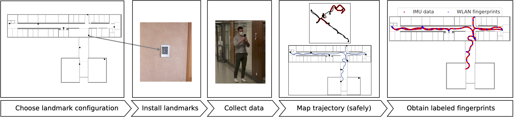

### VI-SLAM2tag



This repository hosts the implementation of the paper

> M. Laska, T. Schulz, J. Grottke, C. Blut and J. Blankenbach, "VI-SLAM2tag: Low-Effort Labeled Dataset Collection for Fingerprinting-Based Indoor Localization," To appear at 2022 International Conference on Indoor Positioning and Indoor Navigation (IPIN), 5 - 7 Sep. 2022, Beijing, China, doi: [10.48550/arXiv.2207.02668](https://doi.org/10.48550/arXiv.2207.02668).

Fingerprinting-based localization is a technique that requires labeled sensor data, where the label is the position of collection.
Typically this data is collected in a site survey, where fingerprints are manually tagged by the collector.
This paper proposes a solution for low-effort labeled data collection by leveraging Android ARCore for automatically obtaining ground truth positions for collected fingerprints.
 
The implementation is split into two major software components:
- The Android smartphone app for data collection (hosted in [VI-SLAM2tag_app](https://github.com/laskama/VI-SLAM2tag_app))
- The postprocessing module for mapping from the local coordinate system of ARCore to the real-world coordinate system (this repository)

For a precise explanation on the provided software, please refer to the detailed description within the paper.

### Installation
The repository can be installed either by cloning the code from git via:
```shell
git clone git@github.com:laskama/VI-SLAM2tag_post.git
```
or by installing it via pip into an existing project via:
```shell
pip install git+ssh://git@github.com:laskama/VI-SLAM2tag_post.git
```
In case of cloning the git repository, the required packages have to be installed. 
Installation via any virtual environment (virtualenv or conda) is recommended.
After the environment is activated, install the required packages listed in ```requirements.txt```

### How to use
The repository can be used for:
- creating the giaIndoorLoc dataset introduced in the paper from the collected raw data,
- reproducing the Figures and Tables of the paper evaluation for assessing the labeling accuracy of the system and
- creating labeled datasets from custom raw data collected via the smartphone application

#### Creation of giaIndoorLoc dataset
To reproduce the giaIndoorLoc dataset from the raw data (giaIndoorLoc_raw), place the raw data in the ```data/``` folder and run the following command:
```shell
python main.py --data_path='vslam2tag/data/' --annotate=True --mapping=local --visualize=True --floors=0,1,2,3,4 --devices=LG,OnePlus,Galaxy,S20 
```
The script allows for specifying a subset of devices or floors or setting different algorithm parameters. Run the command
```shell
python main.py --help
```
to get further information.

You can verify whether the created dataset is identical to the published already post-processed dataset (giaIndoorLoc) by running:
```shell
python dataset_verification.py --verification_path="path/to/giaIndoorLoc/"
```

#### Reproducing the paper evaluation (Figures and Tables)
Download the ```evaluation_data``` and place it within the ```evaluation``` folder. 
Post-process the control-point validation trajectories via executing:
```shell
python main.py --data_path='vslam2tag/evaluation/evaluation_data/' --annotate=False --global_transformation_type affine --visualize=False --floors=1,4 --devices=LG_ref,OnePlus_ref
```
To post-process the total station validation trajectories execute:
```shell
python main.py --data_path='vslam2tag/evaluation/evaluation_data/' --annotate=False --global_transformation_type affine --pos_jump_th 2 --visualize=False --floors=4 --devices=LG_tachy,OnePlus_tachy
```
Afterwards, run the ```paper_plots.py``` script. Note some figures require that the post-processed giaIndoorLoc dataset is located within the ```'vslam2tag/data/'``` folder.


#### Custom dataset creation
Place the raw data within the ```data``` folder. It should follow the same convention as the published raw data. 
The ```floor_dimensions.csv``` should be replaced with the dimension of each floor of the custom dataset (the origin is located at the lower left).
Within each floor folder a floorplan image should be placed that exactly matches the specified floor dimensions. Additionally,
for each floor a ```marker_dict.csv``` should be created that holds the ground truth location of the placed landmarks. 
Finally, the dataset can be created by executing the ```main.py``` script as described before.
